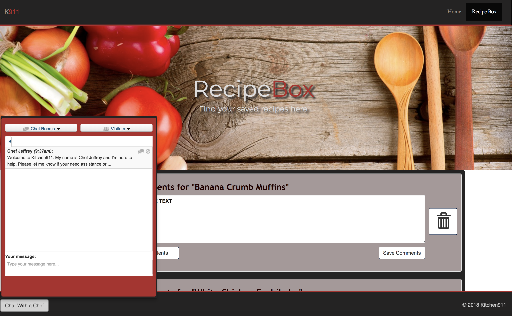

# Kitchen 911

Designed in collaboration with a professional Chef!

Using Food2Fork's API, Kitchen 911 was created to help find creative recipe ideas and to share expert culinary help. 

This application allows the user to search keywords for recipes from food2fork.com. Users are then able to save selected recipes in a "recipe box", where the user can then add their own personal notes about individual recipes.  

Additionally, we implementated a chat function (using the MIT firebase Firechat) to enable users to contact personal and professional help in real time!

## Getting Started

[Open Kitchen911](https://j-tanz.github.io/kitchen911/index.html)

## Wire Frames

### Homepage

### RecipeBox

## Site Preview

### Homepage

### RecipeBox

### Chatbox

## Future Features
* Login authentication
* Search filter

## Contributions

Please feel free to branch off and make some tweaks and make a PR. We're open to any cool suggestions!

## Authors

- [Jeffrey Berman](https://github.com/twistyjeffrey)
- [Samidh Desai](https://github.com/SamDesai333)
- [John Tansor](https://github.com/j-tanz)

## License

This project is licensed under the MIT License - see the [LICENSE.md](LICENSE.md) file for details

## Acknowledgments

- [Food2Fork](https://www.food2fork.com)
- [Firechat](https://github.com/firebase/firechat)
- [FIrebase](https://www.firebase.com)

